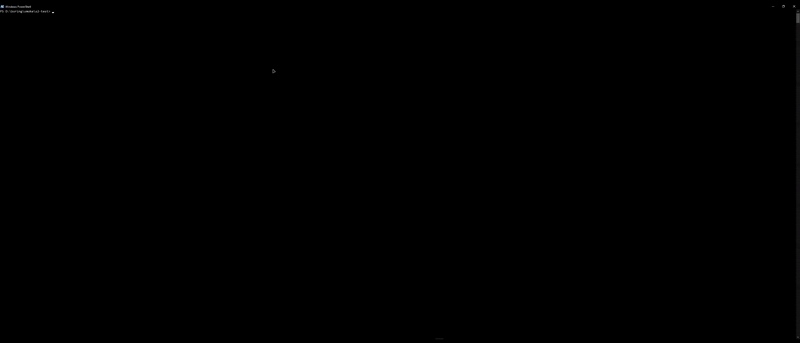

# Wagmi v1 to v2 Automated Codemod

[](https://app.codemod.com/registry/@zerosky1221/wagmi-v1-to-v2)

A production-grade, hybrid Codemod that automates the migration from Wagmi v1 to v2, including the complex TanStack Query v5 `useEffect` callback refactoring.


**[Watch the full 40-second demo on YouTube](https://youtu.be/6LeSqNmRGNI)**

## Quickstart

Run this single command in your project root:
```bash
npx codemod@latest @zerosky1221/wagmi-v1-to-v2 -t ./src
```


## How it Works (Hybrid AST + AI)

1.  **Deterministic AST Layer:** Renames hooks (`useContractRead` → `useReadContract`), updates viem imports.
2.  **AI Layer (Gemini):** Safely identifies deprecated `onSuccess`/`onError` callbacks and natively refactors them into `useEffect` implementations.

## Validation

Tested extensively on `scaffold-eth-2`:

  - **17/17** core contract components migrated perfectly.
  - **0** False Positives.
  - See the full [Case Study](https://github.com/zerosky1221/wagmi-v1-to-v2/blob/main/CASE_STUDY.md) for benchmark details.

<!-- end list -->

